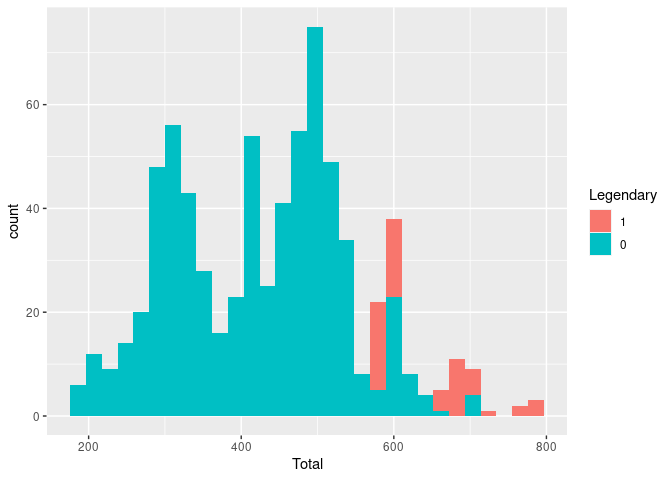
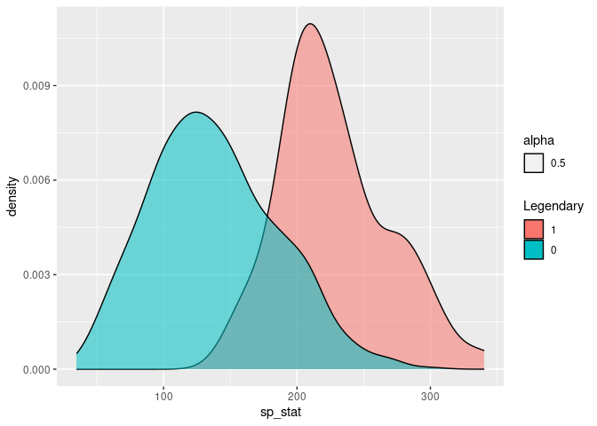
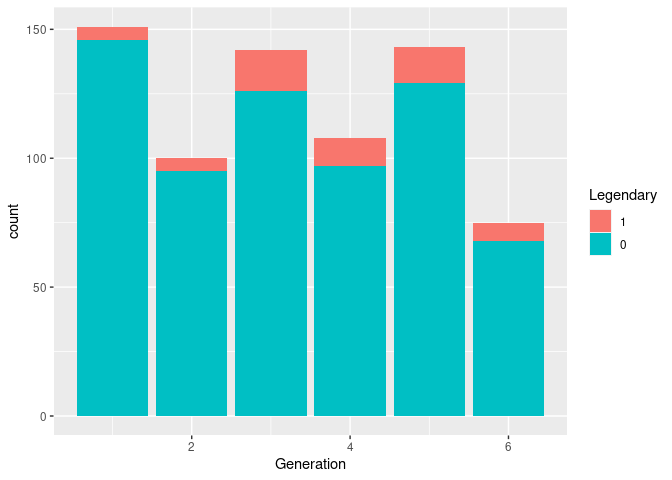
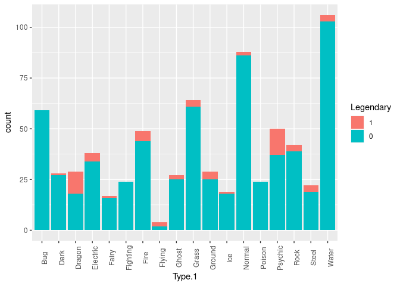

Predicting Legendary Status of Pokemon
================

## Introduction

The aim of the project is to develop a model to predict if a Pokemon is
going to be a Legendary based on its characteristics such as battle
statistics and generation number.

The report will be split into 4 sections, the **introduction**, the
**analysis**, the **results**, and the **conclusion** section.

## Analysis

This section will involve a few key steps, namely **pre-processing**,
**data visualization**, and **model development**.

**Pre-processing**

Before we start, we will import all relevant libraries. Then, we will
save the Kaggle Pokemon dataset into our variable ‘pokemon’.

``` r
pokemon <- read.csv('/home/ryan/Documents/Catching-Legendaries/Pokemon.csv')
head(pokemon)
```

    ##   X.                  Name Type.1 Type.2 Total HP Attack Defense Sp..Atk
    ## 1  1             Bulbasaur  Grass Poison   318 45     49      49      65
    ## 2  2               Ivysaur  Grass Poison   405 60     62      63      80
    ## 3  3              Venusaur  Grass Poison   525 80     82      83     100
    ## 4  3 VenusaurMega Venusaur  Grass Poison   625 80    100     123     122
    ## 5  4            Charmander   Fire          309 39     52      43      60
    ## 6  5            Charmeleon   Fire          405 58     64      58      80
    ##   Sp..Def Speed Generation Legendary
    ## 1      65    45          1     False
    ## 2      80    60          1     False
    ## 3     100    80          1     False
    ## 4     120    80          1     False
    ## 5      50    65          1     False
    ## 6      65    80          1     False

For users who want to reference the original dataset, please feel free
to use the link provided below:  
<https://www.kaggle.com/mlomuscio/pokemon>

When we view the Pokemon dataset, we can see that our main outcome, the
Legendary status, is in the form of a Boolean rather than a 1 or 0
factor. We thus must convert the entire data column before any of it
becomes interpretable. The code is as follows:

``` r
pokemon$Legendary <- factor(pokemon$Legendary, levels = c("True", "False"), labels = c(1, 
    0))
head(pokemon)
```

    ##   X.                  Name Type.1 Type.2 Total HP Attack Defense Sp..Atk
    ## 1  1             Bulbasaur  Grass Poison   318 45     49      49      65
    ## 2  2               Ivysaur  Grass Poison   405 60     62      63      80
    ## 3  3              Venusaur  Grass Poison   525 80     82      83     100
    ## 4  3 VenusaurMega Venusaur  Grass Poison   625 80    100     123     122
    ## 5  4            Charmander   Fire          309 39     52      43      60
    ## 6  5            Charmeleon   Fire          405 58     64      58      80
    ##   Sp..Def Speed Generation Legendary
    ## 1      65    45          1         0
    ## 2      80    60          1         0
    ## 3     100    80          1         0
    ## 4     120    80          1         0
    ## 5      50    65          1         0
    ## 6      65    80          1         0

We now need to split our dataset into training and test sets. For the
purpose of this project, I have split the dataset into 3 partitions, 1
large training set subdivided into two - train\_a and train\_b - and 1
final test set to evaluate the true performance of my model.

``` r
set.seed(1)
test_index <- createDataPartition(y = pokemon$Legendary, times = 1, p = 0.1, list = FALSE)
train_set <- pokemon[-test_index, ]
test_set <- pokemon[test_index, ]

train_index <- createDataPartition(y = train_set$Legendary, times = 1, p = 0.1, list = FALSE)
train_a <- train_set[-train_index, ]
train_b <- train_set[train_index, ]
```

**Data Visualization**

We shall then proceed on to Data Visualization. For this section, I will
only be using the training set so as to preserve the integrity of the
final evaluation set.  
First, we will analyse the relationship between a Pokemon’s battle stats
and its Legendary Status.

``` r
stat_effect <- train_set %>%
    ggplot(aes(x = Total, fill = Legendary)) + geom_histogram()
stat_effect
```

<!-- -->

``` r
sp_effect <- train_set %>%
    mutate(sp_stat = round(Sp..Atk + Sp..Def)) %>%
    ggplot() + geom_density(aes(x = sp_stat, fill = Legendary, alpha = 0.5))
sp_effect
```

<!-- --> We can
see that Legendary Pokemon exist with significantly higher total stat
points. We go into even more detail by separating out the Special Attack
and Special Defense points (sp\_stat) to show how significant stat
points are as a factor in determining a Pokemon’s legendary status.

Next, we will consider the relationship between a Pokemon’s generation
and it’s Legendary status.

``` r
gen_effect <- train_set %>%
    ggplot(aes(x = Generation, fill = Legendary)) + geom_bar()
gen_effect
```

<!-- --> From the
above barplot, we can see that the number of legendary pokemon are
relatively constant across all the generations, with notable exceptions
in only generation 3 and generation 5 with slightly more legendary
pokemon.

Lastly, we shall consider the effect of the Pokemon’s type on their
status.

``` r
type_effect <- train_set %>%
    group_by(Type.1) %>%
    ggplot(aes(x = Type.1, fill = Legendary)) + geom_bar() + theme(axis.text.x = element_text(angle = 90))
type_effect
```

<!-- --> From
this plot, we can see that only the ‘Dragon’ and ‘Psychic’ types have
slightly more number of legendaries. The other types have relatively
constant numbers of legendaries with some types even having none.

With this knowledge, we can proceed to develop our machine-learning
algorithm to predict the legendary status of pokemon in the test set.

**Model Development**

To create my model, I intend to use an ensemble of different machine
learning algorithms - K-Nearest Neighbors, Quadratic Discriminant
Analysis, Linear Discriminant Analysis, Random Forests, and lastly a
Generalized Additive Model using Locally Estimated Scatterplot Smoothing
(LOESS).

I specifically chose to use the two Discriminant Analysis algorithms as
they utilize the Naive Bayes model which performs well with predictions
involving 2 categorical outcomes. Random forests was chosen over
regression trees as it performs significantly better at predicting
categorical outcomes by using more relevant optimizing metrics such as
the Gini index. I chose random forests over decision trees due to its
superior performance and stability by its random process of averaging
multiple decision trees.

Lastly, for my tuning parameters and training controls, I used a 3-fold
cross validation on the KNN and Random Forests model to improve their
stability and accuracy.

Multiple tuning parameters were implemented for the KNN, random forests,
and gamLoess models as well. The train function from the caret package
will automatically select the best tuning parameter to be used for the
model.

To generate the ensemble, each model’s prediction is saved as a list of
integer values of 1s and 0s, with a 1 representing a Legendary
Pokemon.  
As I assume that all the model’s have equal weight, I will simply be
taking the average of all the model’s predictions to calculate the final
prediction for the ensemble.

``` r
model_func <- function(test_set) {

    knn_control <- trainControl(method = "cv", number = 3, p = 0.9)
    knn_fit <- train(Legendary ~ HP + Attack + Defense + Sp..Atk + Sp..Def + Speed + 
        Total + Generation, method = "knn", tuneGrid = data.frame(k = seq(1, 15, 
        2)), trControl = knn_control, data = train_a)
    knn_y_hat <- predict(knn_fit, newdata = test_set, type = "raw")
    knn_y_hat <- ifelse(as.integer(knn_y_hat) == 2, 0, 1)

    qda_fit <- train(Legendary ~ HP + Attack + Defense + Sp..Atk + Sp..Def + Speed + 
        Generation, method = "qda", data = train_a)
    qda_y_hat <- predict(qda_fit, test_set, type = "raw")
    qda_y_hat <- ifelse(as.integer(qda_y_hat) == 2, 0, 1)

    lda_fit <- train(Legendary ~ HP + Attack + Defense + Sp..Atk + Sp..Def + Speed + 
        Generation, method = "lda", data = train_a)
    lda_y_hat <- predict(lda_fit, test_set, type = "raw")
    lda_y_hat <- ifelse(as.integer(lda_y_hat) == 2, 0, 1)

    rf_control <- trainControl(method = "cv", number = 3, p = 0.9)
    rf_grid <- expand.grid(minNode = c(1, 5), predFixed = c(5, 5, 5, 5, 5))
    rf_fit <- train(Legendary ~ HP + Attack + Defense + Sp..Atk + Sp..Def + Speed + 
        Generation, method = "Rborist", ntree = 50, trControl = rf_control, tuneGrid = rf_grid, 
        nSamp = 5000, data = train_a)
    rf_y_hat <- predict(rf_fit, test_set)
    rf_y_hat <- ifelse(as.integer(rf_y_hat) == 2, 0, 1)

    loess_fit <- train(Legendary ~ HP + Attack + Defense + Sp..Atk + Sp..Def + Speed + 
        Generation, method = "gamLoess", tuneGrid = expand.grid(span = seq(0.2, 0.6, 
        len = 2), degree = 1), data = train_a)
    loess_y_hat <- predict(loess_fit, test_set)
    loess_y_hat <- ifelse(as.integer(loess_y_hat) == 2, 0, 1)

    final_y_hat <- (knn_y_hat + qda_y_hat + lda_y_hat + rf_y_hat + loess_y_hat)/4
    final_y_hat <- ifelse(final_y_hat < 0.5, 0, 1)
    final_y_hat <- final_y_hat %>%
        factor(levels = levels(test_set$Legendary))
    return(confusionMatrix(data = final_y_hat, reference = test_set$Legendary)$overall["Accuracy"])

}
```

## Results

Before I implemented the model on the final test set, I trialed it on
the smaller train set, train\_b, to fine-tune the code.

``` r
model_func(train_b)
model_func(test_set=test_set)
```

The accuracy from the train\_b set is 0.959, while the accuracy from the
final test set is 0.963. The ensemble model achieves close to 97%
accuracy and therefore can be considered a good predictor of a Pokemon’s
Legendary status.

## Conclusion

It is surprising that the accuracy on the final test set is higher than
the accuracy of the training set. However, since the smaller train set
was used in the same way as the final test set, we can argue that the
difference in accuracy is due to random error from the sampling itself.
Furthermore, the small size of the entire pokemon dataset (\~ 800)
entries, and the small size of the test set could have contribute to the
variation as well.

All in all, the small size of the dataset poses a significant challenge
to accuracy. We have tried to maintain a high accuracy through ensuring
that the dataset used to train our model is as large as possible, while
also using an ensemble of algorithms to predict the final outcome.

In the future, we could consider using other methods like Principal
Component Analysis to elucidate further links between the different
predictors.
